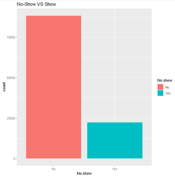

# No-show-Paitent-analysis

## An R based Data Analytics Project.

The objective of this project is to use predictive techniques to develop and compare appointment no-show prediction models to better understand appointment adherence in general population. 

---------------------------------------------------------------------------------------------------------

### Analysis of the dataset:

Age

Gender

SMS reminder

Health Factors

Show Vs No-show

